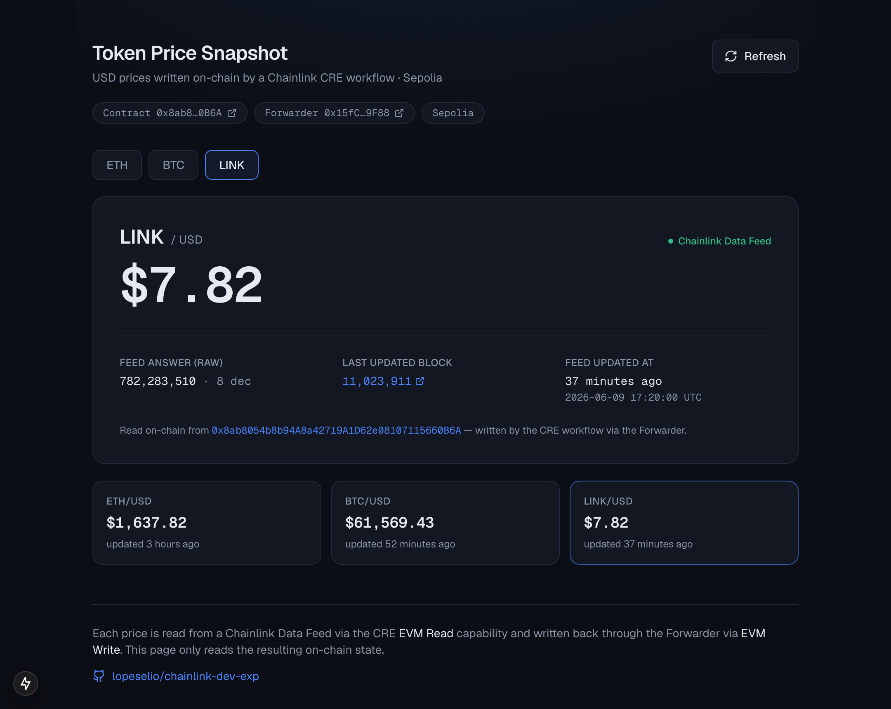

# Token Price Snapshot — Chainlink CRE Workflow

[](https://github.com/lopeselio/chainlink-dev-exp/actions/workflows/ci.yml)

A [Chainlink Runtime Environment (CRE)](https://docs.chain.link/cre) workflow that, in a **single
HTTP‑triggered execution**:

1. Accepts a JSON body such as `{ "token": "ETH" }` over an **HTTP trigger**.
2. Reads the token's current USD price from a **Chainlink Data Feed** on Ethereum Sepolia via the
   **EVM Read** capability (not hardcoded, not from an external API).
3. Writes the result on‑chain to a custom `Snapshot` contract via the **EVM Write** capability.

The workflow is written in **TypeScript** and is runnable with:

```bash
cre workflow simulate my-workflow --broadcast
```

---

## Live deployment (Sepolia)

A working instance is deployed and was exercised end‑to‑end via `cre workflow simulate --broadcast`:

| Item | Value |
| ---- | ----- |
| `Snapshot` contract (verified) | [`0x8ab8054b8b94A8a42719A1D62e08107115660B6A`](https://sepolia.etherscan.io/address/0x8ab8054b8b94A8a42719A1D62e08107115660B6A#code) |
| Forwarder it trusts (Sepolia Mock) | [`0x15fC6ae953E024d975e77382eEeC56A9101f9F88`](https://sepolia.etherscan.io/address/0x15fC6ae953E024d975e77382eEeC56A9101f9F88) |
| Example write tx (ETH/USD) | [`0x893ea0…6492`](https://sepolia.etherscan.io/tx/0x893ea0936d1553c177285734745ee081026eba385f509020fb54eb55c6876492) |
| Live dashboard | https://frontend-lopeselios-projects.vercel.app |

The example transaction's `to` is the **Forwarder**, which then calls `onReport` on the `Snapshot`
contract — confirming the forwarder check passes only for forwarder‑delivered reports. After the run,
`latestSnapshot()` returns `("ETH", 163782021225, 11023067, 1781015412)` (price with 8 decimals =
\$1637.82, the feed's last‑update block, and its `updatedAt`).

---

## Bonus: live dashboard

An optional read‑only [Next.js dashboard](frontend/) renders the snapshots written on‑chain — it
reads `latestSnapshot()` / `snapshotOf()` from the contract via viem (it does not trigger the
workflow).

**Live:** https://frontend-lopeselios-projects.vercel.app · run locally with `cd frontend && bun install && bun run dev`.



---

## Architecture

```
        HTTP POST { "token": "ETH" }
                  │
                  ▼
        ┌──────────────────────┐
        │  CRE workflow (TS)    │
        │  my-workflow/         │
        │                       │
        │  1. parse token       │
        │  2. EVM Read ──────────┼──►  Chainlink Data Feed proxy (ETH/USD, Sepolia)
        │       latestRoundData  │         └─ underlying aggregator emits AnswerUpdated
        │       decimals         │
        │       aggregator()     │
        │  3. find update block ─┼──►  filterLogs(AnswerUpdated) → block of last update
        │  4. build Record       │
        │  5. EVM Write ─────────┼──►  KeystoneForwarder ──► Snapshot.onReport(...)
        └──────────────────────┘                                   │
                                                                    ▼
                                                      Snapshot contract stores Record
                                                      { token, price, blockNumber, timestamp }
```

The `Record` written on‑chain is:

| Field         | Source                                                                              |
| ------------- | ----------------------------------------------------------------------------------- |
| `token`       | The HTTP request body                                                               |
| `price`       | `latestRoundData().answer` from the Data Feed (raw, feed‑native decimals — 8 for USD) |
| `blockNumber` | The block at which the feed answer was **last updated** (from the `AnswerUpdated` event) |
| `timestamp`   | `latestRoundData().updatedAt` (the feed's own last‑update timestamp)                 |

---

## Repository layout

```
.
├── my-workflow/                 # CRE workflow (TypeScript)
│   ├── main.ts                  # entry point — wires the Runner
│   ├── workflow.ts              # HTTP trigger → EVM Read → EVM Write
│   ├── config.staging.json      # chain, feeds, deployed Snapshot address, gas
│   ├── config.production.json
│   └── workflow.yaml            # per-target workflow settings
├── contracts/                   # Foundry project
│   ├── src/
│   │   ├── ISnapshot.sol         # Record struct + snapshot() signature (per assignment)
│   │   ├── Snapshot.sol          # IReceiver consumer with the forwarder check
│   │   └── keystone/             # vendored IReceiver / IERC165 (no external deps)
│   ├── script/DeploySnapshot.s.sol
│   └── test/Snapshot.t.sol       # 9 passing tests
├── project.yaml                 # per-target RPC endpoints
├── secrets.yaml                 # secrets template (no real values)
├── .env.example                 # env template (no real secrets)
└── README.md
```

---

## Prerequisites

- [`cre` CLI](https://docs.chain.link/cre/getting-started/cli-installation) — `cre login` (simulation needs no deploy access).
- [Foundry](https://book.getfoundry.sh/) (`forge`, `cast`).
- [Bun](https://bun.sh/) or Node ≥ 20 for the TypeScript workflow.
- A funded **Sepolia** EOA private key. Faucet: <https://faucets.chain.link/sepolia>.

```bash
git clone https://github.com/lopeselio/chainlink-dev-exp.git
cd chainlink-dev-exp
git submodule update --init --recursive   # pulls forge-std
cp .env.example .env                       # then edit .env (see below)
(cd my-workflow && bun install)            # or: npm install
```

---

## Step 1 — Deploy the `Snapshot` contract to Sepolia

The contract receives CRE writes through the Chainlink **Forwarder**, so it is constructed with the
forwarder address it should trust. **Simulation and production use different forwarders**, and
`cre workflow simulate --broadcast` delivers through the **`MockKeystoneForwarder`**:

| Mode                                  | Sepolia forwarder (`FORWARDER_ADDRESS`)        |
| ------------------------------------- | ---------------------------------------------- |
| `cre workflow simulate --broadcast`   | `0x15fC6ae953E024d975e77382eEeC56A9101f9F88` (Mock) |
| Production CRE deployment             | `0xF8344CFd5c43616a4366C34E3EEE75af79a74482` (KeystoneForwarder) |

> Addresses from the [CRE Forwarder Directory](https://docs.chain.link/cre/guides/workflow/using-evm-client/forwarder-directory).

Set `FORWARDER_ADDRESS`, `SEPOLIA_RPC_URL`, and your key in `.env`, then deploy:

```bash
cd contracts
forge build
forge test                                  # 9 tests should pass

source ../.env
forge create src/Snapshot.sol:Snapshot \
  --rpc-url "$SEPOLIA_RPC_URL" \
  --private-key "$CRE_ETH_PRIVATE_KEY" \
  --broadcast \
  --constructor-args "$FORWARDER_ADDRESS"
```

> Keep `--constructor-args` **last**: it is variadic and will otherwise swallow flags
> placed after it (e.g. `--broadcast`), silently leaving you in dry-run mode.

(Or use the script: `forge script script/DeploySnapshot.s.sol:DeploySnapshot --rpc-url "$SEPOLIA_RPC_URL" --private-key "$CRE_ETH_PRIVATE_KEY" --broadcast`.)

Copy the deployed address.

## Step 2 — Point the workflow at your contract

Edit `my-workflow/config.staging.json` and set `snapshotAddress` to the address from Step 1:

```jsonc
{
  "chainName": "ethereum-testnet-sepolia",
  "snapshotAddress": "0xYourDeployedSnapshot",   // ← paste here
  "gasLimit": "500000",
  "answerUpdatedLookbackBlocks": 7200,
  "feeds": {
    "ETH":  "0x694AA1769357215DE4FAC081bf1f309aDC325306",
    "BTC":  "0x1b44F3514812d835EB1BDB0acB33d3fA3351Ee43",
    "LINK": "0xc59E3633BAAC79493d908e63626716e204A45EdF"
  }
}
```

Feed addresses: [Chainlink Data Feeds on Sepolia](https://docs.chain.link/data-feeds/price-feeds/addresses?network=ethereum&page=1&testnetPage=1).

## Step 3 — Run the workflow

```bash
cre workflow simulate my-workflow --broadcast
```

The CLI prompts you to pick the trigger (`http-trigger`) and enter the payload — paste:

```json
{ "token": "ETH" }
```

To run it fully non‑interactively (handy for CI / repeated runs):

```bash
cre workflow simulate my-workflow --broadcast \
  --non-interactive --trigger-index 0 \
  --http-payload '{"token":"ETH"}'
```

Expected output (price/blocks will differ):

```
[USER LOG] HTTP trigger received: token=ETH
[USER LOG] Read ETH/USD: 1672.73784 (raw=167273784000, decimals=8, roundId=18446744073709585161)
[USER LOG] Data feed answer last updated at block 11022555 (scanned 11015653-11022853).
[USER LOG] Snapshot written onchain. tx=0x…
✓ Workflow Simulation Result:
{ "token": "ETH", "price": "167273784000", "priceScaled": "1672.73784",
  "blockNumber": "11022555", "timestamp": "1781009244", "txHash": "0x…" }
```

Drop `--broadcast` for a dry run (the write is simulated and `txHash` is `0x000…0`).

Verify on‑chain afterward by calling `latestSnapshot()` / `snapshotOf("ETH")` on your contract
(e.g. on [Sepolia Etherscan](https://sepolia.etherscan.io)). Note the write transaction's `to` is
the **Forwarder**, which then calls `onReport` on the `Snapshot` contract.

---

## How each requirement is met

| Requirement                                                            | Where |
| ---------------------------------------------------------------------- | ----- |
| Single HTTP‑triggered execution                                        | `HTTPCapability().trigger(...)` + `onHttpTrigger` in `my-workflow/workflow.ts` |
| Accept `{ "token": "ETH" }`                                            | `requestSchema.parse(...)` of the trigger payload |
| Price read from a Chainlink Data Feed via **EVM Read**                 | `callContract` → `latestRoundData()` (not hardcoded, no external API) |
| `blockNumber` = block at which the answer was last updated             | `findLastUpdateBlock()` — see design note below |
| Write on‑chain via **EVM Write**                                       | `runtime.report(...)` + `evmClient.writeReport(...)` |
| `Record` struct + `snapshot` function signature                        | `contracts/src/ISnapshot.sol`, implemented in `Snapshot.sol` |
| Forwarder check present and correct                                    | immutable `i_forwarder` + `onlyForwarder` on `onReport` and `snapshot` |
| Runnable with `cre workflow simulate my-workflow --broadcast`          | verified (see Step 3) |
| No real secrets committed                                              | `.env.example` + `secrets.yaml` template; real `.env` gitignored |

---

## Design notes

### Sourcing the “block at which the answer was last updated”

A Chainlink aggregator does **not** expose the update block through a getter — `latestRoundData`
only returns the `updatedAt` *timestamp*. The block is exposed through the **`AnswerUpdated`** event,
which the underlying aggregator emits whenever a new answer takes effect. So the workflow:

1. reads the proxy's current implementation via `aggregator()` (the proxy itself does not emit `AnswerUpdated`);
2. scans recent `AnswerUpdated` logs on that aggregator with `filterLogs` (window =
   `answerUpdatedLookbackBlocks`, default 7200 ≈ 24h on Sepolia);
3. takes the most recent log's block number as the last‑update block, cross‑checking its indexed
   `current` answer against `latestRoundData().answer`.

All reads and the log scan are anchored to the **last finalized block** for consistency.

### Forwarder check (`Snapshot.sol`)

`onReport` is the function the Forwarder calls. The contract stores an **immutable** `i_forwarder`
(set at deployment, reverts on `address(0)`) and guards both `onReport` and the named `snapshot`
function with `onlyForwarder`. It also implements ERC‑165 `supportsInterface` for `IReceiver`, which
the Forwarder checks before delivering. An optional, owner‑settable `expectedWorkflowOwner` adds
defense‑in‑depth by validating the workflow owner from the report `metadata`; it is disabled by
default so simulation (which uses a `MockKeystoneForwarder` without identity metadata) works
out of the box.

### Price decimals

`price` is stored as the **raw** feed answer (USD feeds use 8 decimals). The workflow logs the
human‑readable value (`priceScaled`) and returns `decimals` so consumers can scale it.

---

## References

- [CRE documentation](https://docs.chain.link/cre)
- [Building consumer contracts](https://docs.chain.link/cre/guides/workflow/using-evm-client/onchain-write/building-consumer-contracts)
- [CRE Forwarder Directory](https://docs.chain.link/cre/guides/workflow/using-evm-client/forwarder-directory)
- [Chainlink Data Feed addresses (Sepolia)](https://docs.chain.link/data-feeds/price-feeds/addresses)
- [Sepolia ETH faucet](https://faucets.chain.link/sepolia)
